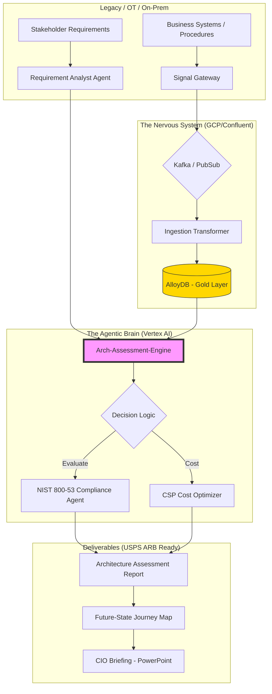

# mia-agentic-arch-eval-system ⚡

Mia Agentic Architecture Assessment Engine

**Objective:** To automate the extraction of system requirements from stakeholder engagement notes and generate USPS-compliant Architecture Assessments, including Future-State Journey Maps and Cost Analysis.

**Key Features:**

* **Multi-Agent Orchestration:** Uses specialized agents to evaluate "Optimum Performance vs. Cost Effectiveness" (as per BAH/USPS requirements).

* **IA-as-Code:** Automates the creation of technical illustrations for CIO-level briefings.

# MIA-Agentic-Arch-Eval-System (POC-V4)
> **Solutions Architecture & Agentic Data Orchestration for High-Compliance Environments**

## 🎯 Executive Overview
This Proof of Concept (POC) demonstrates a robust, **Agentic Architecture Evaluation System** designed to bridge legacy OT/On-Prem systems with modern Cloud Service Providers (GCP/AWS). It automates the creation of **Architecture Assessments**, **Journey Maps**, and **Cost-Effectiveness Analysis**—specifically tailored for USPS/Public Sector requirements.

---

## 🏗️ System Architecture (The Nervous System)

The following diagram illustrates the flow from raw stakeholder requirements and streaming telemetry through the Agentic Brain to generate approved Architecture Assessments.

---

