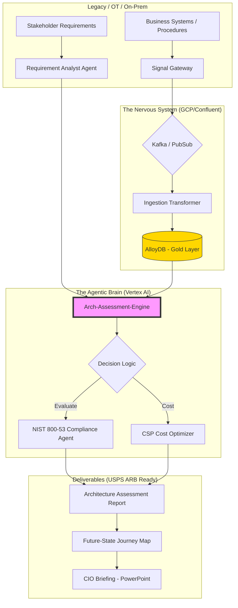

# mia-agentic-arch-eval-system ⚡

Mia Agentic Architecture Assessment Engine

**Objective:** To automate the extraction of system requirements from stakeholder engagement notes and generate USPS-compliant Architecture Assessments, including Future-State Journey Maps and Cost Analysis.

**Key Features:**

* **Multi-Agent Orchestration:** Uses specialized agents to evaluate "Optimum Performance vs. Cost Effectiveness" (as per BAH/USPS requirements).

* **IA-as-Code:** Automates the creation of technical illustrations for CIO-level briefings.


# MIA-Agentic-Arch-Eval-System (POC-V4)
> **Solutions Architecture & Agentic Data Orchestration for High-Compliance Environments**

## 🎯 Executive Overview
This Proof of Concept (POC) demonstrates a robust, **Agentic Architecture Evaluation System** designed to bridge legacy OT/On-Prem systems with modern Cloud Service Providers (GCP/AWS). It automates the creation of **Architecture Assessments**, **Journey Maps**, and **Cost-Effectiveness Analysis**—specifically tailored for USPS/Public Sector requirements.

---

## 🏗️ System Architecture (The Nervous System)

The following diagram illustrates the flow from raw stakeholder requirements and streaming telemetry through the Agentic Brain to generate approved Architecture Assessments.



---
Quick Start
....
---

More to come

---

## 📂 Finalizing the Folder Structure
### 🌳 Extended Repository Structure

```paintext

../mia-agentic-arch-eval-system
├── agent
│   └── knowledge-base
│       └── usps-business-logic
│           └── arb-standards-2026.pdf      <-- Context for RAG
├── api
│   ├── openapi
│   │   └── assessment-api.yaml             <-- Contract-first design
│   └── proto
│       └── assessment.proto                <-- High-performance gRPC
├── data
│   └── output
│       └── reports
│           └── sample-assessment.docx      <-- Generated deliverable POC
├── database
│   ├── migrations
│   │   └── 000001_init_schema.up.sql       <-- AlloyDB Gold Layer schema
│   └── scripts
│       └── cdc-setup
│           └── oracle-to-alloydb.sh        <-- Actual legacy integration script
├── diagrams
│   └── as-code
│       └── system-nervous-system.py        <-- Diagrams-as-code (Diagrams lib)
├── docs
│   ├── architecture
│   │   └── blueprints
│   │       └── hybrid-cloud-security.md
│   ├── compliance
│   │   └── nist-800-53
│   │       └── control-mapping.xlsx        <-- The "Security Advisor" proof
│   └── usps-templates
│       └── assessment-v1.md
├── notebooks
│   └── exploration
│       └── prompt-tuning-v4.ipynb          <-- Proves "Actual Work Experience" with AI
├── pkg
│   ├── observability
│   │   ├── logger.go
│   │   └── metrics.go
│   ├── resilience
│   │   ├── circuit_breaker.go
│   │   └── retry.go
│   └── vertexai
│       └── client.go                       <-- The wrapper we built
├── README.md
├── schemas
│   ├── avro
│   │   └── telemetry.avsc                  <-- Kafka/Confluent schema
│   └── protobuf
│       └── assessment.proto
├── services
│   ├── ai-agent
│   │   └── internal
│   │       └── logic
│   │           └── prompts
│   │               └── arb_assessment_v1.tmpl
│   ├── arch-assessment-engine
│   │   ├── cmd
│   │   │   └── main.go                     <-- Entry point
│   │   └── internal
│   │       └── reporting
│   │           └── engine.go
│   ├── contract-validator
│   │   └── internal
│   │       └── validator
│   │           └── rules.go                <-- Logic to ensure NIST compliance
│   ├── ingestion-transformer
│   │   └── internal
│   │       └── medallion
│   │           └── transform_logic.go      <-- Medallion architecture (Bronze->Gold)
│   ├── signal-gateway
│   │   ├── cmd
│   │   │   └── main.go
│   │   └── internal
│   │       └── handler
│   │           └── telemetry_handler.go
│   └── worker-dataflow
│       └── cmd
│           └── pipeline_job.go             <-- Go-based Dataflow job
└── terraform
    ├── environments
    │   ├── dev
    │   │   └── main.tf
    │   └── prod
    │       └── main.tf
    └── modules
        ├── alloydb
        │   └── main.tf                     <-- Regional HA setup
        ├── artifact-registry
        │   └── main.tf
        ├── aws-glue-sync
        │   └── main.tf                     <-- Multi-cloud sync proof
        ├── gke-cluster
        │   └── main.tf                     <-- Autopilot for cost effectiveness
        ├── hybrid-vpn-gateway
        │   └── main.tf
        ├── kms-encryption
        │   └── main.tf
        ├── pubsub
        │   └── main.tf
        └── vpc-network
            └── main.tf                     <-- Multi-region topology
... 
in progress
```


